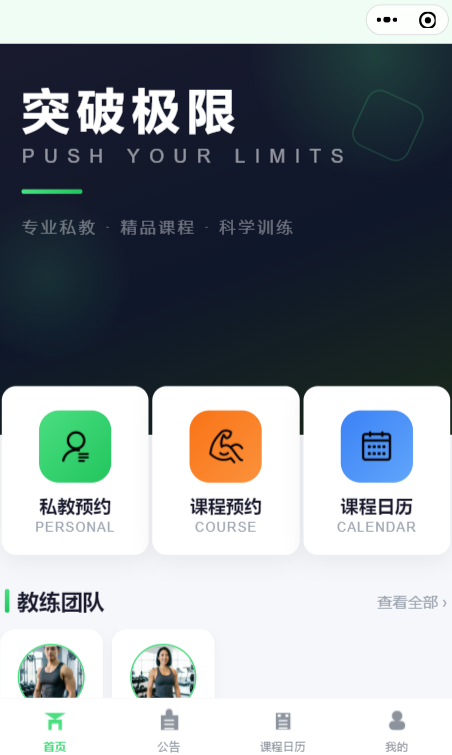
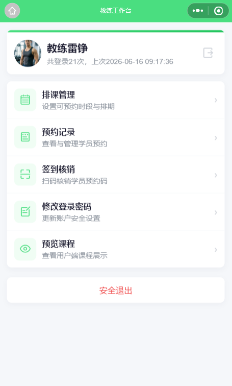
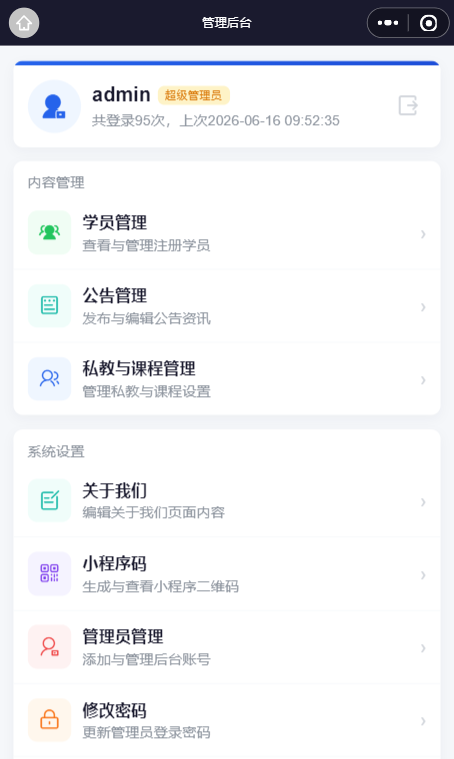

# 健身房私教预约小程序

> A WeChat Mini Program for gym personal trainer booking.
> Three roles: User, Coach (Work), Admin.
> Built with WeChat Cloud Base — zero server cost.

基于微信云开发的健身房私教预约管理系统，支持用户端、教练端、管理后台三端一体化管理。用户可在线浏览教练课程、选择时段完成预约，教练端可管理排期与核销，管理后台提供完整的预约数据管理与导出能力。

## 功能特性

### 用户端
- **课程浏览**：查看教练课程列表与详情
- **日历预约**：按日期查看可预约时段，快速预约
- **预约管理**：查看、取消我的预约记录
- **注册登录**：手机号一键注册，微信静默登录

### 教练端
- **排期管理**：设定可预约时段及各时段人数上限
- **核销管理**：扫码/手动核销用户预约码
- **预约名单**：查看已预约用户名单，管理预约状态
- **资料编辑**：修改个人头像、简介、星级等信息

### 管理后台
- **管理员管理**：多级管理员账号，操作日志审计
- **课程管理**：创建/编辑/删除课程，自定义预约表单字段
- **用户管理**：用户列表、详情、状态管理
- **预约管理**：预约列表查看、状态管理、核销、导出 Excel
- **公告管理**：发布/编辑/排序平台公告
- **系统设置**：小程序码生成、关于页配置

## 界面预览

| 用户端 | 教练端 | 管理后台 |
|--------|--------|----------|
|  |  |  |

> 更多截图见 [界面截图](docs/SCREENSHOTS.md)

## 技术栈

| 层级 | 技术 |
|------|------|
| 前端 | 微信小程序原生框架（Component 模式） |
| 后端 | 微信云函数（单函数 `main` + 路由分发） |
| 数据库 | 微信云开发数据库（集合前缀 `bx_`） |
| 认证 | bcryptjs 加密 + Token 鉴权 |
| 导出 | node-xlsx 数据导出 |

## 系统架构

```
┌─────────────────────────────────────────┐
│              用户端 / 教练端 / 管理端      │  frontcode/
├─────────────────────────────────────────┤
│            utils/cloud.js                │  云函数调用封装层
├─────────────────────────────────────────┤
│         wx.cloud.callFunction            │  wx-server-sdk
├─────────────────────────────────────────┤
│           backcode/main/index.js         │  路由入口
├─────────────────────────────────────────┤
│    passport/  home/  news/  meet/        │  模块分发
│         admin/  work/                    │
├─────────────────────────────────────────┤
│     common/ (auth, db, response, ...)    │  公共层
└─────────────────────────────────────────┘
```

## 项目结构

```
frontcode/                  # 前端代码（微信小程序）
├── services/               # 业务模块
│   ├── auth.js             # 用户登录认证
│   ├── admin.js            # 管理后台业务
│   ├── work.js             # 教练端业务
│   ├── meet.js             # 预约业务
│   ├── news.js             # 公告业务
│   ├── user.js             # 用户业务
│   └── common.js           # 通用业务
├── utils/                  # 工具模块
│   ├── cloud.js            # 云函数调用封装
│   ├── router.js           # 页面路由导航
│   ├── validate.js         # 表单校验
│   ├── cache.js            # 本地缓存
│   ├── constants.js        # 常量定义
│   └── ...
├── components/             # 组件
│   ├── public/             # 通用组件 (calendar, list, form, etc.)
│   └── business/           # 业务组件 (detail, foot)
├── pages/                  # 页面
│   ├── index/              # 首页
│   ├── meet/               # 用户预约
│   ├── my/                 # 个人中心
│   ├── news/               # 公告
│   ├── admin/              # 管理后台
│   └── work/               # 教练端
├── config/setting.js       # 项目配置
└── app.js / app.json       # 小程序入口

backcode/main/              # 后端云函数
├── index.js                # 主入口 — 路由分发
├── common/                 # 公共层
│   ├── auth.js             # Token 鉴权
│   ├── db.js               # 数据库 CRUD 封装
│   ├── response.js         # 统一响应格式
│   ├── validate.js         # 参数校验
│   └── util.js             # 工具函数
├── admin/                  # 管理端（~40 接口）
├── work/                   # 教练端（15 接口）
├── meet/                   # 用户端预约（11 接口）
├── passport/               # 登录通行证
├── home/                   # 首页
└── news/                   # 公告
```

## 快速开始

### 前置要求

1. 注册[微信小程序](https://mp.weixin.qq.com/)
2. 开通[云开发](https://developers.weixin.qq.com/miniprogram/dev/wxcloud/basis/getting-started.html)
3. 下载安装[微信开发者工具](https://developers.weixin.qq.com/miniprogram/dev/devtools/download.html)

### 安装步骤

```bash
# 1. 克隆项目
git clone https://github.com/your-username/your-repo.git

# 2. 安装云函数依赖
cd backcode/main
npm install
```

### 配置

1. **配置云环境 ID**

   打开 `frontcode/config/setting.js`，将 `CLOUD_ID` 改为你的云环境 ID：

   ```js
   module.exports = {
     CLOUD_ID: 'your-cloud-env-id',   // 在此填入云环境 ID
     IS_DEMO: false,                   // 是否为演示模式
     IMG_UPLOAD_SIZE: 20,             // 图片上传上限（MB）
     CACHE_IS_LIST: true,             // 是否缓存列表
     CACHE_LIST_TIME: 1800,           // 缓存时间（秒）
   }
   ```

2. **在微信开发者工具中打开项目**

   - 打开开发者工具 → 导入项目
   - 项目目录选择：项目根目录
   - AppID：你的小程序 AppID（或使用测试号）

3. **创建云函数并上传**

   在开发者工具中：
   - 右键 `cloudfunctions/main` → 创建并部署（云端安装依赖）
   - 或使用命令行部署

### 数据集合

项目启动后系统会自动创建以下集合（前缀 `bx_`）：

- `bx_admin` — 管理员
- `bx_meet` — 课程/教练
- `bx_meet_join` — 预约记录
- `bx_meet_day` — 排期设置
- `bx_meet_temp` — 时段模板
- `bx_news` — 公告
- `bx_user` — 用户
- `bx_card` / `bx_card_log` — 健身卡

### 初始化管理员

部署后数据库会自动初始化一个默认管理员账号，如需手动创建，在 `bx_admin` 集合中插入一条记录：

```json
{
  "ADMIN_ID": "admin",
  "ADMIN_PWD": "$2a$10$...", // bcrypt 加密后的密码
  "ADMIN_TYPE": 1,
  "ADMIN_STATUS": 1,
  "ADMIN_NAME": "超级管理员",
  "ADD_TIME": 1700000000
}
```

### 创建教练

在 `bx_meet` 集合中创建教练课程记录：

```json
{
  "MEET_ID": "10001",
  "MEET_TITLE": "李教练",
  "MEET_PHONE": "13800138000",
  "MEET_PWD": "$2a$10$...", // bcrypt 加密后的密码
  "MEET_STATUS": 1,
  "MEET_IMGS": [],
  "MEET_STAR": 5,
  "ADD_TIME": 1700000000
}
```

## 默认账号

| 角色 | 账号 | 密码 |
|------|------|------|
| 超级管理员 | `admin` | `123456` |

> 请首次登录后及时修改默认密码。

## API 响应格式

所有接口统一返回格式：

```json
{ "code": 200, "data": {}, "msg": "ok" }     // 成功
{ "code": 1600, "msg": "业务错误提示" }       // 业务错误
{ "code": 1301, "msg": "参数校验失败" }       // 参数错误
{ "code": 2401 }                              // 管理员认证失败
{ "code": 2501 }                              // 教练认证失败
{ "code": 500 }                               // 服务器错误
```

## 关键约定

- **Token 路由选择**：前端云调用根据路由前缀自动选择 Token（`admin/` → 管理员、`work/` → 教练、其余 → 用户）
- **前端组件化**：所有页面使用 `Component()` 而非 `Page()`
- **`validate.check()` 返回新对象**：调用后需要通过 `this.data.xxx` 访问不在校验规则中的字段
- **0 值是 falsy**：判断时使用 `!= null` 而非 `||`
- **WXSS 限制**：微信 3.16.0+ 禁止标签选择器和 ID 选择器，需使用 class 选择器

## 开发相关

### 页面路由

```
用户端：   pages/index/ → 首页
          pages/meet/ → 预约功能
          pages/my/ → 个人中心
          pages/news/ → 公告

管理后台： pages/admin/login/ → 登录
          pages/admin/home/ → 仪表盘
          pages/admin/meet/ → 课程管理
          pages/admin/manager/ → 管理员管理
          pages/admin/user/ → 用户管理
          pages/admin/news/ → 公告管理

教练端：   pages/work/login/ → 登录
          pages/work/home/ → 工作台
          pages/work/time/ → 排期管理
          pages/work/join/ → 预约名单
          pages/work/scan/ → 核销
```

### 云函数调用

```js
const cloud = require('../../utils/cloud.js');

// 查询数据
const data = await cloud.callCloudData('meet/list', { page: 1, size: 20 });

// 提交数据
const result = await cloud.callCloudSubmit('meet/join', { meetId: 'xxx' });

// 分页列表
await cloud.dataList(that, 'listName', 'meet/list', params);
```

## 许可证

[MIT](LICENSE)

## 文档

- [系统架构](docs/ARCHITECTURE.md)
- [API 接口文档](docs/API.md)
- [开发指南](docs/DEVELOPMENT.md)
- [界面截图](docs/SCREENSHOTS.md)
