# 界面截图

所有截图位于 `demo/` 目录，共 33 张。

## 用户端（12 张）

| 截图 | 说明 |
|------|------|
|  | 首页 — 顶部导航 + 功能入口 |
| 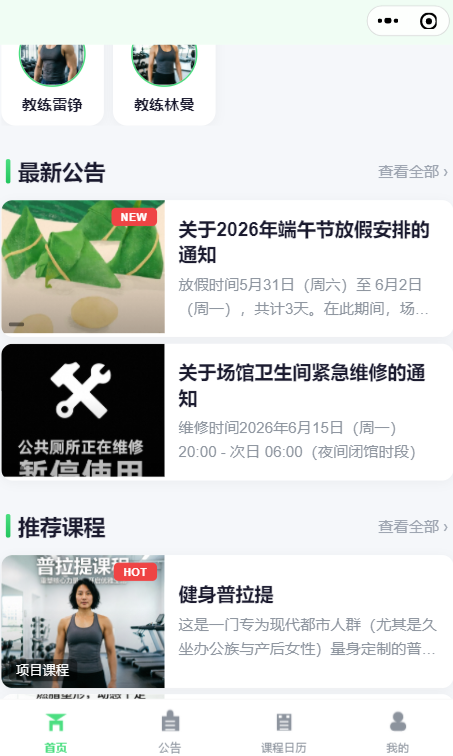 | 首页 — 课程推荐 + 公告 |
| 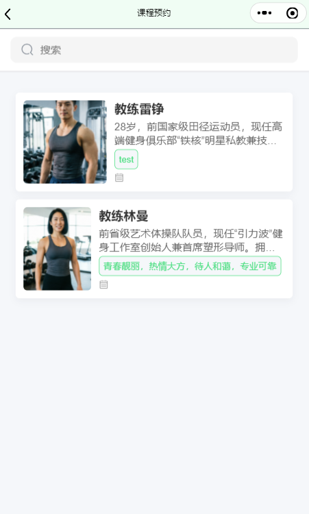 | 教练详情页 — 封面 + 简介 + 时段 |
| 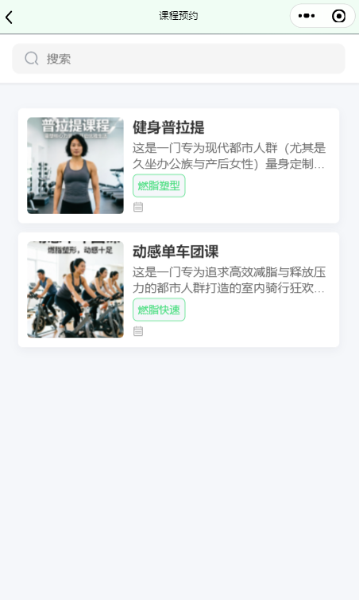 | 课程详情页 — 课程信息 + 预约 |
| 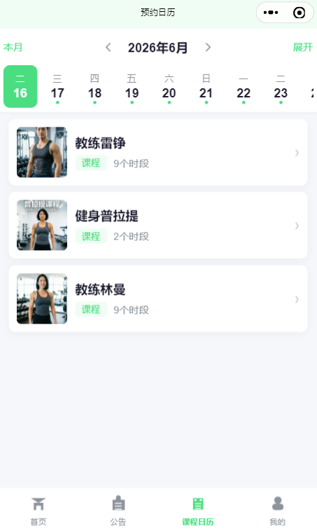 | 日历预约 — 月历视图选日期 |
| 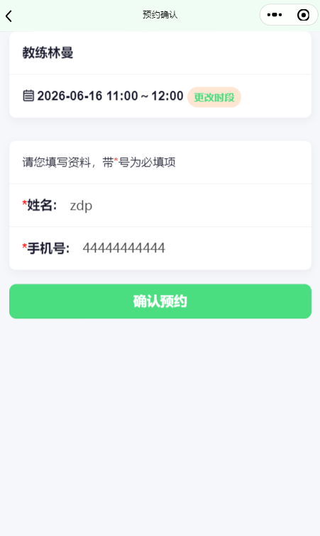 | 预约确认 — 填写信息并提交 |
| 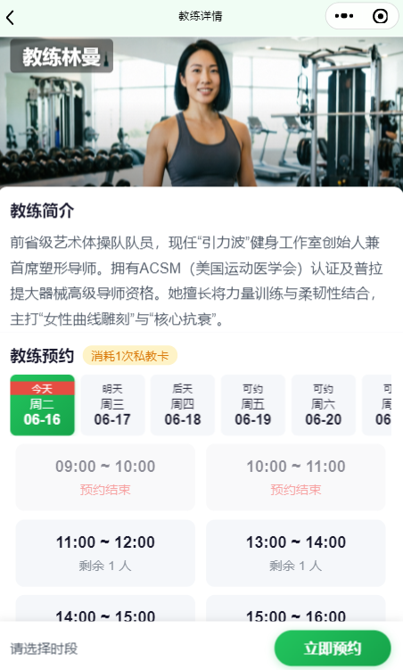 | 教练海报 — 分享图片 |
| 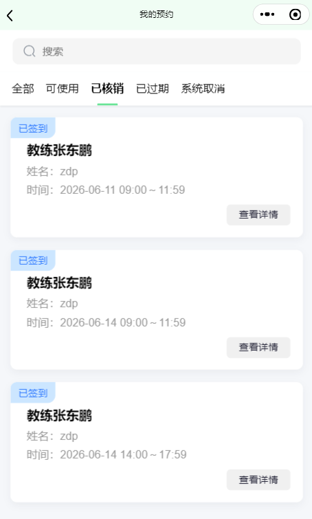 | 预约记录 — 已约/已签到/已过期 |
| 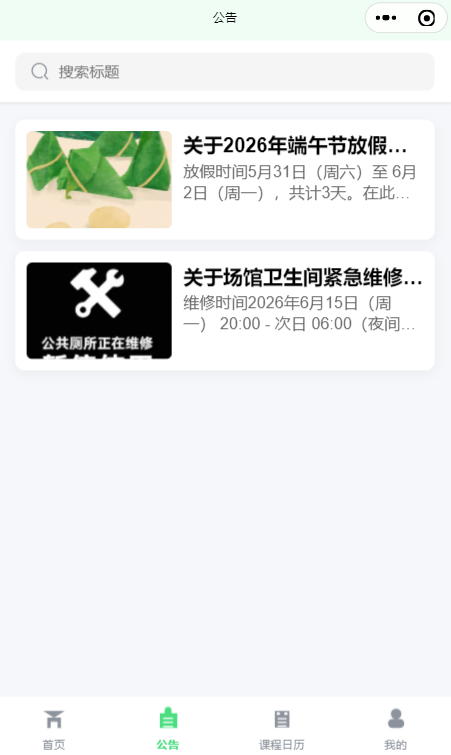 | 公告列表 — 平台通知 |
| 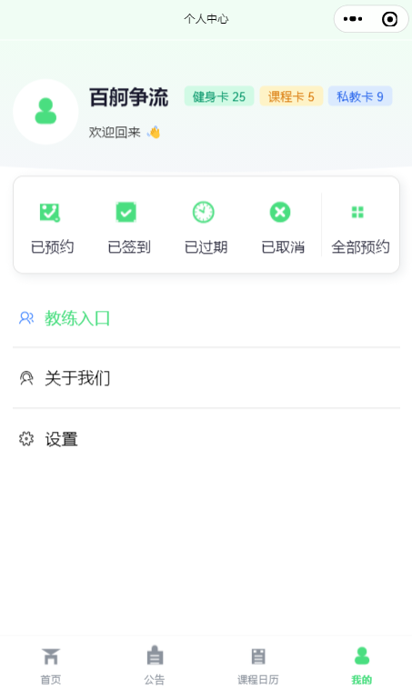 | 个人中心 — 健身卡 + 菜单 |
| 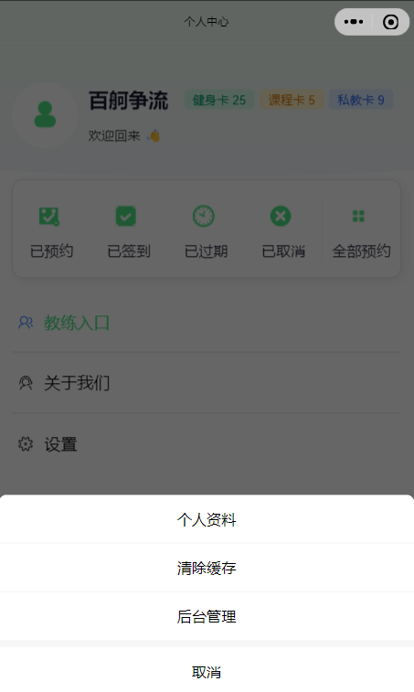 | 个人中心 — 设置菜单展开 |
|  | 关于我们 — 平台介绍 |

## 教练端（6 张）

| 截图 | 说明 |
|------|------|
| 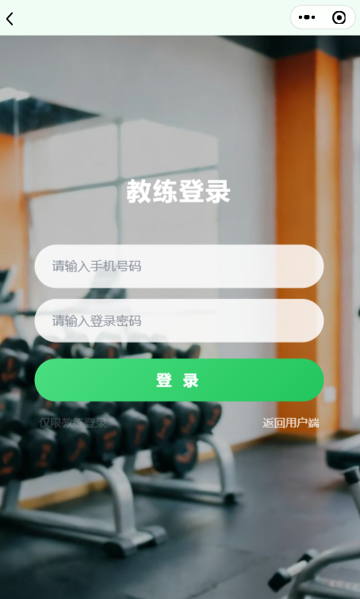 | 教练登录 — 手机号 + 密码 |
|  | 工作台 — 今日排期概览 |
| 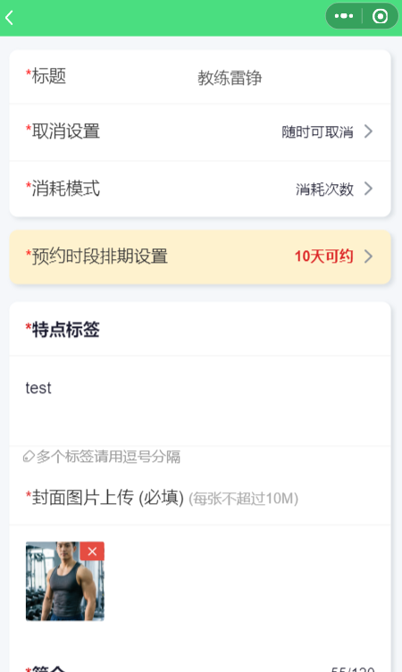 | 排课管理 — 日历选日期 + 时段设置 |
| 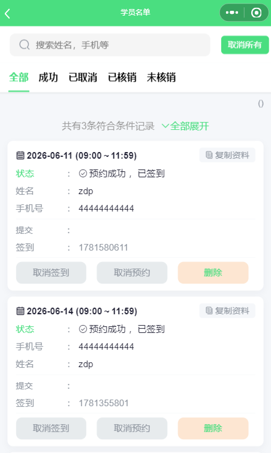 | 预约记录 — 学员列表 + 签到 |
| 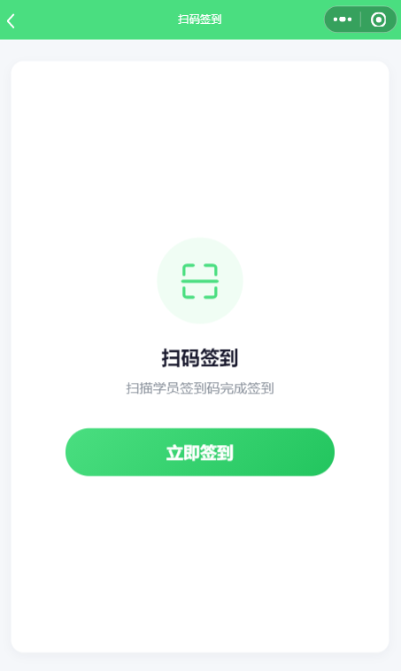 | 扫码核销 — 扫码验证预约 |
| 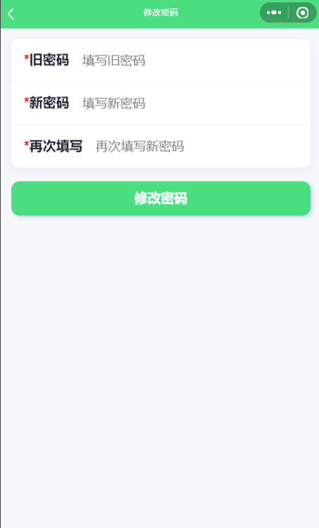 | 修改密码 — 安全设置 |

## 管理后台（15 张）

| 截图 | 说明 |
|------|------|
| 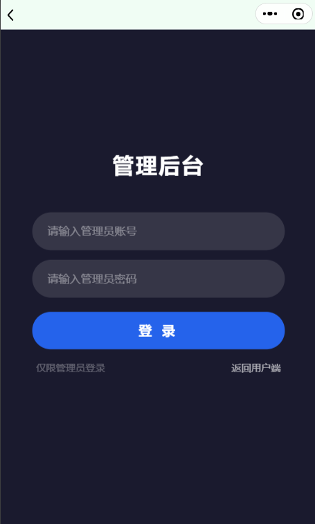 | 管理员登录 |
| 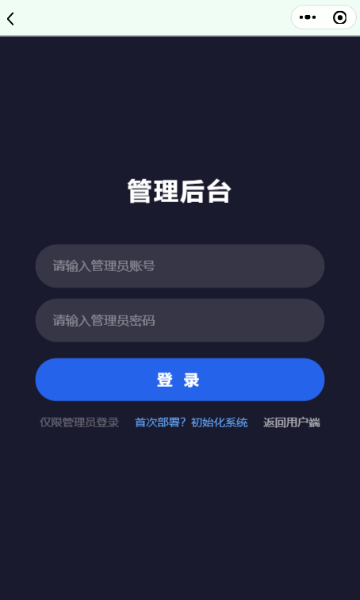 | 初始化 — 首次部署入口 |
| 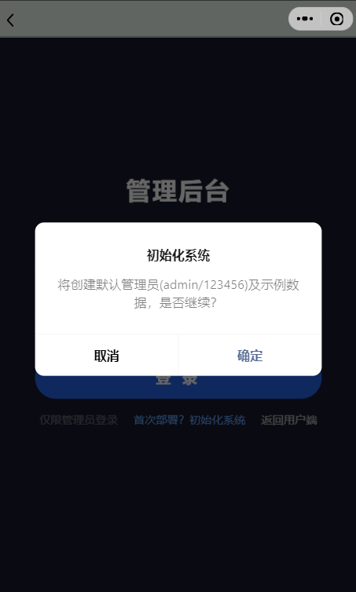 | 初始化 — 确认弹窗 |
|  | 仪表盘 — 数据概览 |
| 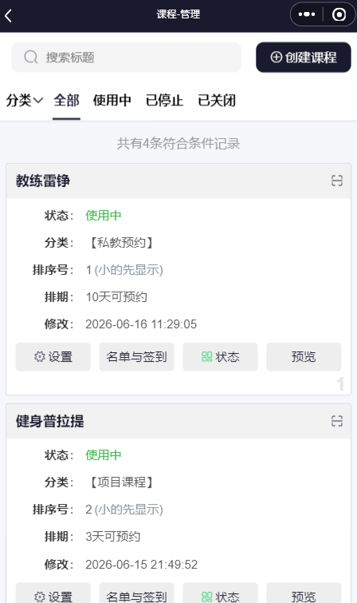 | 课程列表 — 管理全部课程 |
| 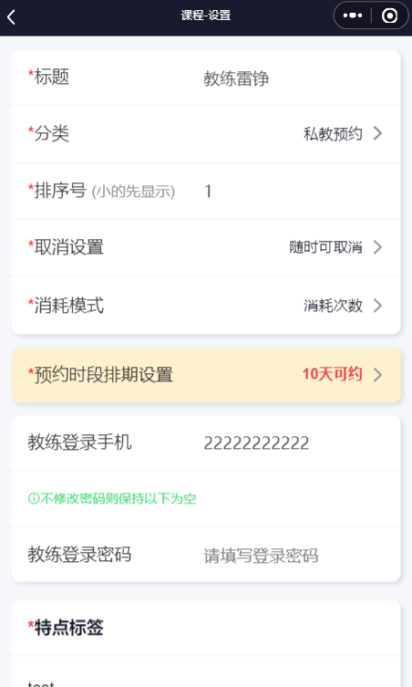 | 课程编辑 — 教练类型设置 |
| 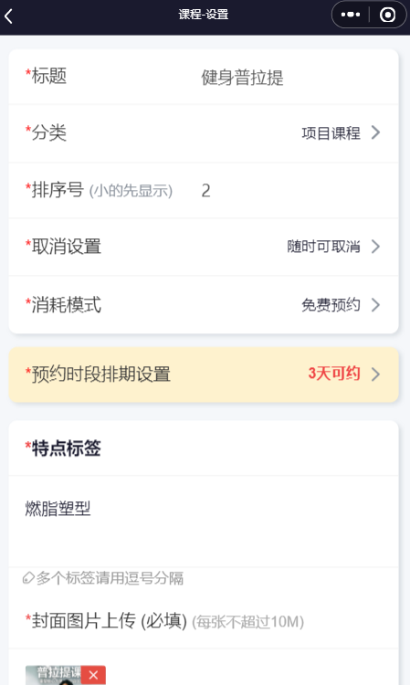 | 课程编辑 — 课程类型设置 |
| 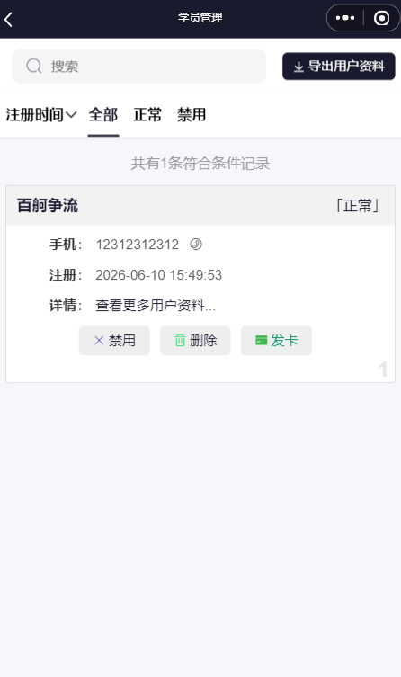 | 学员列表 — 含发卡入口 |
| 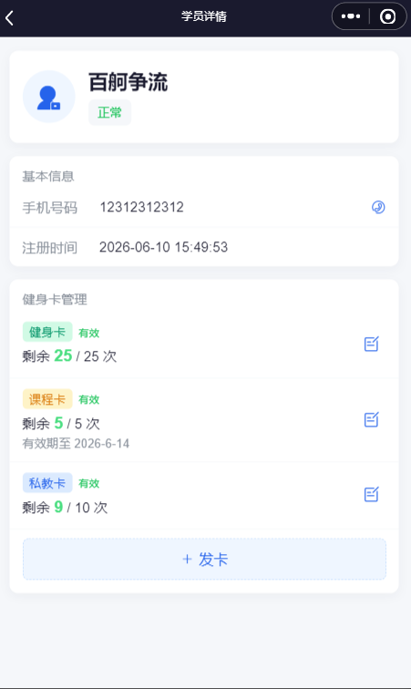 | 学员详情 — 健身卡管理 |
| 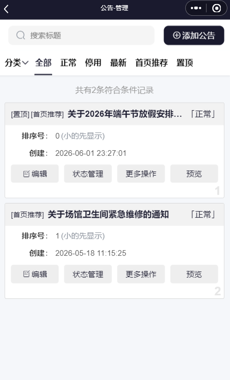 | 公告列表 — 发布管理公告 |
| 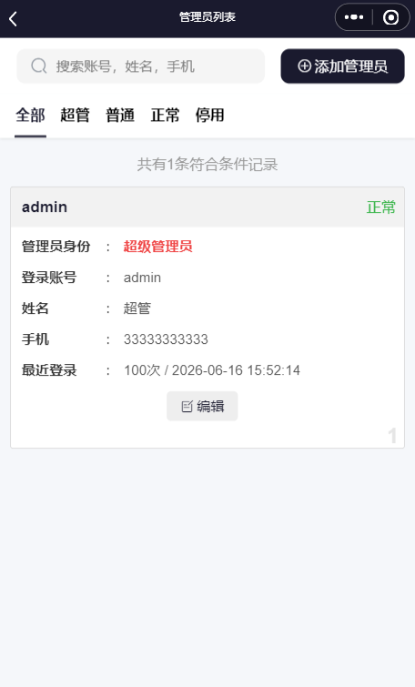 | 管理员管理 |
| 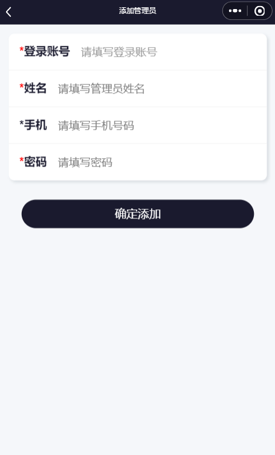 | 添加管理员 — 填写信息 |
| 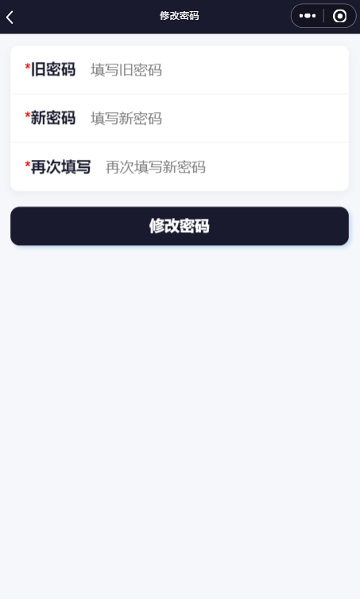 | 管理员修改密码 |
| 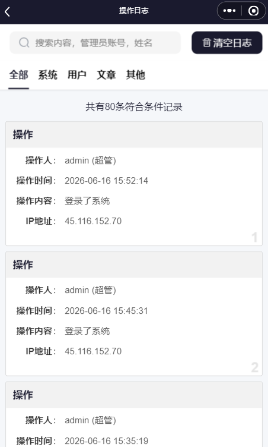 | 操作日志 — 系统操作记录 |
| 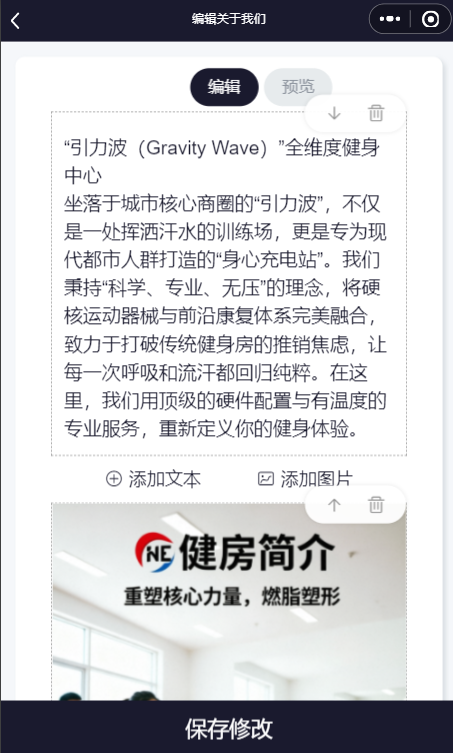 | 编辑关于我们 — 富文本编辑 |
